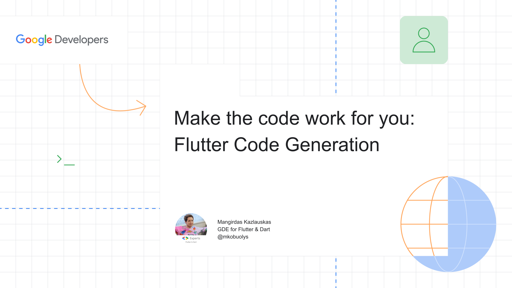

# Flutter Code Generation Examples



Code generation packages/tools used in the app:

- flutter_localization/intl
- build_runner
- flutter_gen/flutter_gen_runner
- freezed/freezed_annotation
- json_serializable
- mason

## Presentation

Presentation slides are provided [here](slides/Flutter Code Generation.pdf).

Talk video could be found here: TBD.

## Building

You can follow these instructions to build the app and install it onto your device.

### Prerequisites

If you are new to Flutter, please first follow the [Flutter Setup](https://flutter.dev/setup/) guide.

### Building and installing the Flutter Code Generation Examples app

```
git clone https://github.com/mkobuolys/flutter-code-generation.git
cd flutter-code-generation
flutter pub get
flutter pub run build_runner build
flutter run
```

The `flutter run` command both builds and installs the Flutter app to your device or emulator.
